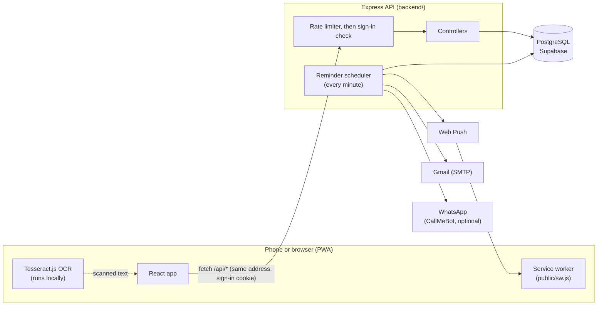

<div align="center">


# FocusFlow

**A study companion for students that keeps your subjects, classes, exams, grades and reminders in one place.**

Scan your timetable or date sheet, and FocusFlow tells you when your next class is, which exam is coming up, what your GPA looks like, and whether you've handed in that assignment.


[](https://github.com/AHMADMALIK1376/FocusFlow/actions/workflows/ci.yml)

</div>

---

## Contents

- [What is FocusFlow?](#what-is-focusflow)
- [Features](#features)
- [Tech stack](#tech-stack)
- [How it fits together](#how-it-fits-together)
- [Project structure](#project-structure)
- [Getting started](#getting-started)
- [Environment variables](#environment-variables)
- [Backend scripts](#backend-scripts)
- [Running the tests](#running-the-tests)
- [API overview](#api-overview)
- [How the scanner works](#how-the-scanner-works)
- [How reminders work](#how-reminders-work)
- [Security](#security)
- [Deployment](#deployment)
- [Design system](#design-system)
- [Project docs](#project-docs)
- [Roadmap](#roadmap)
- [Author](#author)

---

## What is FocusFlow?

FocusFlow started as a general productivity app and has been rebuilt around **students** at school, college and university. Everything is organised around your **subjects**. A subject ties together its class times, attendance, grades, exams, assignments, notes and flashcards.

All data is saved per account in a PostgreSQL database, so it's the same on your phone and your laptop. The app installs on a phone as a **Progressive Web App (PWA)**, so you don't need the Play Store, and it can send reminder pop-ups even when it's closed.

---

## Features

### Study

| Feature | What it does |
|---|---|
| **Dashboard** | A personal home screen. A snapshot strip shows your CGPA, next exam countdown, flashcards due and today's classes. Below it are widgets you can turn on, off and reorder (timetable, calendar, goals, focus timer, metrics, notes, habits, budget and more). You can keep more than one dashboard. |
| **Subjects** | Your courses shown as a **periodic table**. Each subject is an "element" with its course code, credit-hour dots and a dashed edge for labs. A small **week abacus** card shows one bead per class on each day of the week. |
| **Subject hub** (`/subjects/:id`) | One page per subject with its schedule, attendance, grades, exams, assignments and flashcards. |
| **Exams & Deadlines** | Exams, quizzes, tests, presentations, vivas, practicals and submissions, with a countdown ("3 days left"), sorted soonest first. |
| **Assignment board** (`/projects`) | A drag-and-drop To-do / Doing / Done board for assignments and group projects. |

### Track

| Feature | What it does |
|---|---|
| **Attendance** | Mark each class Present, Absent, Late or Excused, and see the attendance % for every subject. |
| **Grades / GPA / CGPA** | Add quiz, assignment, midterm, final and project marks with weights. You get a weighted percentage, letter grade and grade points per subject, then a CGPA weighted by credit hours (default 4.0 scale). |
| **Deep Work / Focus mode** | A focus timer that saves every session and keeps a history. |
| **Study-hours log** (`/time`) | Time your study sessions by label and see where your hours go in a chart. |
| **Budget** | Pocket-money budgeting: monthly allowance, spending by category, money left and a savings goal (default currency PKR). |

### Learn

| Feature | What it does |
|---|---|
| **Notes** | Quick notes with simple Markdown-style formatting. |
| **Flashcards** | Decks of question-and-answer cards, which can belong to a subject, studied with **Leitner spaced repetition**. A correct answer moves a card up a box (due again in 1, 3, 7 or 14 days); a wrong answer sends it back to box 1. |

### Plan

| Feature | What it does |
|---|---|
| **Daily Routine** | A weekly class timetable and routine view. |
| **Study streaks** (`/habits`) | Daily study habits with current and best streaks. |
| **Goals** | Academic goals with milestone checklists and progress. |

### Works across the app

- **Screenshot scanner.** Take a screenshot of your university portal's timetable, date sheet, marks or assignments list. FocusFlow reads it in the browser with OCR, shows every row on an editable review screen, and then saves only what's new or changed. [More below](#how-the-scanner-works).
- **Reminders** by phone pop-up (web push), email, and optionally WhatsApp: classes, exams, deadlines, routine items, a morning digest, plus follow-up questions like *"Did you attend?"*, *"Did you submit?"* and *"How did the quiz go?"*. You can answer straight from the notification or email. [More below](#how-reminders-work).
- **Sign in** with email and password (with email verification and password reset codes) or with **Google**.
- **Onboarding** for new accounts.
- **26 languages** to choose from in Settings, with full translations for English, Spanish, French, German, Portuguese, Arabic, Chinese, Hindi and Urdu. The others fall back to English. Right-to-left layout works for Arabic, Urdu, Persian and Hebrew.
- **Light and dark mode.**
- **Installable PWA** with its own icons, a home-screen shortcut and a service worker for notifications.
- **12-hour times** everywhere in the interface. Data is stored as 24-hour time underneath.

---

## Tech stack

| Layer | Technology |
|---|---|
| **Frontend** | React 19 (Create React App), React Router 7, Tailwind CSS 3, Framer Motion, Recharts, dnd-kit (drag and drop), lucide-react (icons), i18next, Tesseract.js (OCR), Lottie |
| **Backend** | Node.js, Express 4, JSON Web Tokens, bcryptjs, helmet, compression, express-rate-limit, node-cron, nodemailer (Gmail), web-push (VAPID) |
| **Database** | PostgreSQL on [Supabase](https://supabase.com), through `pg` |
| **Testing** | Jest and React Testing Library (frontend), Node's built-in `node:test` runner (backend) |
| **Hosting (plan)** | Vercel (frontend), Render (backend), Supabase (database). All free tiers. |

---

## How it fits together



1. The React app calls the API through `frontend/src/services/api.js`. That file adds the saved login token to every request. If the server says the token is expired or the account no longer exists, it signs the user out.
2. Each request goes through the rate limiter, then `middleware/auth.js` (which checks the token and that the user still exists), then a controller, which runs SQL against Postgres.
3. Once a minute, `services/notificationScheduler.js` works out which reminders are due in each user's own timezone and sends them by push, email or WhatsApp.

For a step-by-step walkthrough of the code paths, see [`flow.md`](flow.md).

---

## Project structure

```
FocusFlow/
├── backend/                     Node + Express API
│   ├── server.js                Entry point: env checks, middleware, routes, scheduler
│   ├── config/
│   │   ├── database.js          Postgres pool (plus a layer that accepts the older Oracle-style SQL)
│   │   └── postgres-init.sql    Full database schema
│   ├── controllers/             One file per feature (subjects, exams, grades, ...)
│   ├── routes/                  Express routers, mounted under /api/*
│   ├── middleware/              auth.js (JWT), rateLimiters.js, errorHandler.js
│   ├── services/                Reminder scheduler, push/email/WhatsApp delivery, email templates and queue
│   ├── utils/                   Pure logic: gpa.js, srs.js (flashcards), reminders.js
│   ├── scripts/                 Database setup, seeding, previews and diagnostics
│   └── assets/                  Logo and line-icon PNGs used in emails
│
├── frontend/                    React app (Create React App)
│   ├── public/                  index.html, manifest.json, sw.js (service worker), icons
│   ├── scripts/                 Python helpers that generate the logo and icon art
│   └── src/
│       ├── App.js               Providers and routes
│       ├── Pages/               One component per screen
│       ├── components/          Layout, dashboard widgets, subjects, charts, UI kit
│       ├── features/            Logic and hooks per feature (scanner, grades, exams, ...)
│       ├── services/api.js      Every API call goes through here
│       ├── design/tokens.css    Default colour tokens (the theme engine in design/theme/ overrides them)
│       ├── i18n/                Translations (locales/*.json)
│       └── preferences/         Dashboard layouts and user preferences
│
├── docs/superpowers/            Design specs and phase-by-phase implementation plans
├── decision.md                  Log of every design and code decision, with reasons
└── flow.md                      How execution moves through the code
```

---

## Getting started

### Prerequisites

- **Node.js 18 or newer** (20 LTS or later recommended) and npm
- A **PostgreSQL** database. A free [Supabase](https://supabase.com) project works and is what the app is built for. SSL is required.
- A **Gmail account with an App Password** for sending verification and reminder emails ([how to create one](https://support.google.com/accounts/answer/185833))

### 1. Clone the repository

```bash
git clone https://github.com/AHMADMALIK1376/FocusFlow.git
```

```bash
cd FocusFlow
```

### 2. Set up the backend

```bash
cd backend
```

```bash
npm install
```

Create `backend/.env` (see [Environment variables](#environment-variables) for what each one does):

```env
PORT=5555
NODE_ENV=development

# Auth: use a long random string, at least 32 characters
JWT_SECRET=replace-with-a-long-random-secret-of-32-plus-chars

# PostgreSQL (Supabase > Project Settings > Database)
PGHOST=your-project-host.supabase.co
PGPORT=5432
PGDATABASE=postgres
PGUSER=postgres
PGPASSWORD=your-database-password

# Email (Gmail + App Password)
EMAIL_USER=you@gmail.com
EMAIL_PASS=your-16-char-app-password

# Links used in emails and notifications
APP_URL=http://localhost:3000
PUBLIC_API_URL=http://localhost:5555

# Web push (optional; without these, phone pop-ups are turned off)
VAPID_PUBLIC_KEY=
VAPID_PRIVATE_KEY=
VAPID_SUBJECT=mailto:you@example.com

# Timezone used when a user hasn't picked one
DEFAULT_TZ=Asia/Karachi
```

Create the database tables (safe to run more than once):

```bash
node scripts/run-init.js
```

Start the API in development mode (restarts on file changes):

```bash
npm run dev
```

You should see `FocusFlow Backend running on port 5555`. Check it at <http://localhost:5555/api/health>.

### 3. Set up the frontend

In a second terminal:

```bash
cd frontend
```

```bash
npm install
```

> `frontend/.npmrc` sets `legacy-peer-deps=true`, so a plain `npm install` works with React 19.

The app calls `/api` on its own address, and the dev server passes it on to the backend on port 5555 (the `proxy` setting in `frontend/package.json`), so there is nothing to configure. Start the backend first.

Start the app:

```bash
npm start
```

Then open <http://localhost:3000>, create an account and verify it with the code sent by email.

> **Tip:** if the verification email doesn't arrive while you're developing, `node scripts/get-code.js you@example.com` (run in `backend/`) prints the current code from the database.

### 4. (Optional) Turn on phone notifications

Generate a VAPID key pair once:

```bash
npx web-push generate-vapid-keys
```

Put the two keys in `backend/.env` as `VAPID_PUBLIC_KEY` and `VAPID_PRIVATE_KEY`, then restart the backend. In the app, open **Settings > Reminders** and allow notifications. On Android, install the app with **Add to Home screen** for the most reliable pop-ups.

### 5. (Optional) Google sign-in

The Google button uses the OAuth client ID set in `frontend/src/Pages/Authpage.js`. To use your own, create an OAuth client in the [Google Cloud Console](https://console.cloud.google.com/apis/credentials), add your app's address (for example `http://localhost:3000`) to its authorised JavaScript origins, and replace the `client_id` value.

---

## Environment variables

### Backend (`backend/.env`)

| Variable | Required | Purpose |
|---|:---:|---|
| `JWT_SECRET` | Yes | Signs the sign-in. Use at least 32 characters; the server warns if it's shorter. |
| `PGHOST` | Yes | Postgres host |
| `PGUSER` | Yes | Postgres user |
| `PGPASSWORD` | Yes | Postgres password |
| `PGPORT` | No | Defaults to `5432` |
| `PGDATABASE` | No | Defaults to `postgres` |
| `EMAIL_USER` | Yes | Gmail address that sends emails |
| `EMAIL_PASS` | Yes | Gmail App Password (not your normal password) |
| `PORT` | No | API port. Defaults to `5000`, but the frontend expects `5555` locally. |
| `APP_URL` | No | Frontend address used in email links. Defaults to `http://localhost:3000`. |
| `PUBLIC_API_URL` | No | Public API address used in "answer from the email" links. Defaults to `http://localhost:5555`. |
| `VAPID_PUBLIC_KEY` / `VAPID_PRIVATE_KEY` | No | Turn on web push. Without them, push is skipped and email still works. |
| `ALLOWED_ORIGINS` | No | Extra websites allowed to call the API, comma separated. In production only these and `APP_URL` are allowed. |
| `VAPID_SUBJECT` | No | Contact for the push service, for example `mailto:you@example.com` |
| `DEFAULT_TZ` | No | Default reminder timezone. Defaults to `Asia/Karachi`. |
| `NODE_ENV` | No | `development` or `production` |

The server **refuses to start** if any required variable is missing and prints which ones.

### Frontend (`frontend/.env`)

| Variable | Purpose |
|---|---|
| `REACT_APP_API_URL` | **Leave it unset.** The app then calls `/api` on its own address, which keeps the sign-in cookie first-party. Setting it sends calls straight to another address, where the cookie is not kept. |

> Never commit `backend/.env`. It's already in `.gitignore`.

---

## Backend scripts

Run these from the `backend/` folder. All of them read `backend/.env`.

| Command | What it does |
|---|---|
| `npm start` | Starts the API (production) |
| `npm run dev` | Starts the API with nodemon (restarts on changes) |
| `npm test` | Runs the backend unit tests |
| `node scripts/run-init.js` | Creates every table in `config/postgres-init.sql` |
| `node scripts/db-status.js` | Lists the tables and their row counts |
| `node scripts/smoke-db.js` | Checks the database layer against the live database |
| `node scripts/get-code.js <email>` | Prints the current verification or reset code for an email |
| `node scripts/preview-emails.js` | Renders every email template into `backend/email-previews/` so you can open them in a browser. Nothing is sent. |
| `node scripts/test-email.js` | Sends a test email |
| `node scripts/seed-user.js` | Fills a demo account with sample data |
| `node scripts/reset-db.js` | **Deletes all accounts and data.** Use with care. |
| `node scripts/migrate-*.js` | Older one-off migrations kept for existing databases. A fresh database only needs `run-init.js`. |

---

## Running the tests

The same checks run automatically on GitHub for every push and pull request (`.github/workflows/ci.yml`): backend tests, frontend tests, and the production build with `CI=true`, which is how Vercel builds.

**Backend** (GPA, flashcard scheduling, reminder rules, email messages, auth, rate limiting):

```bash
cd backend
```

```bash
npm test
```

**Frontend** (scanners and parsers, timetable import, exams, grades, dashboards, UI components). Run once without watch mode:

```bash
cd frontend
```

```bash
npm test -- --watchAll=false
```

The scanner tests use real OCR output from university portal screenshots, stored in `src/features/scanner/__fixtures__/` and `src/features/subjects/__fixtures__/`.

---

## API overview

All routes are under `/api`. Every route except the auth routes and health checks needs the sign-in cookie, and any request that changes data also needs the header `X-Requested-With: FocusFlow` (the app adds it).

| Area | Base path | Main endpoints |
|---|---|---|
| Auth | `/api/auth` | `POST /register`, `/verify-email`, `/resend-verification`, `/login`, `/logout`, `/forgot-password`, `/verify-reset-code`, `/reset-password`, `/google`; `GET /me` |
| Subjects | `/api/subjects` | `GET /`, `POST /`, `GET /:id`, `PUT /:id`, `DELETE /:id` |
| Attendance | `/api/subject-attendance` | `GET /all`, `GET /overview`, `GET`/`POST /subjects/:subjectId`, `DELETE /records/:recordId` |
| Grades | `/api/grades` | `GET /`, `POST /`, `GET /gpa`, `PUT /:id`, `DELETE /:id` |
| Exams & deadlines | `/api/exams` | `GET /`, `POST /`, `PUT /:id`, `PUT /:id/toggle`, `DELETE /:id` |
| Assignments | `/api/assignments` | `GET /`, `POST /`, `PUT /:id`, `PUT /:id/move`, `DELETE /:id` |
| Flashcards | `/api/flashcards` | `GET`/`POST /decks`, `GET`/`DELETE /decks/:id`, `POST /decks/:id/cards`, `PUT`/`DELETE /cards/:cardId`, `POST /cards/:cardId/review` |
| Notes | `/api/notes` | `GET /`, `POST /`, `PUT /:id`, `DELETE /:id` |
| Goals | `/api/goals` | `GET /`, `POST /`, `PUT /:id`, `DELETE /:id`, `POST /:id/milestones`, `PUT /milestones/:milestoneId/toggle`, `DELETE /milestones/:milestoneId` |
| Habits | `/api/habits` | `GET /`, `POST /`, `POST /:id/toggle`, `PUT /:id`, `DELETE /:id` |
| Routine | `/api/routines` | `GET /`, `GET /today`, `POST /`, `PUT /:id`, `POST /:routineId/complete`, `DELETE /:routineId` |
| Focus sessions | `/api/focus` | `GET /sessions`, `GET /sessions/:sessionId`, `POST /sessions`, `DELETE /sessions/:sessionId` |
| Study hours | `/api/study-hours` | `GET /`, `POST /`, `DELETE /:id` |
| Budget | `/api/budget` | `GET /`, `POST /entries`, `DELETE /entries/:id`, `PUT /settings` |
| Dashboard | `/api/dashboard` | `GET /complete`, `GET /stats` |
| Reminders | `/api/notify` | `GET`/`PUT /settings`, `POST /subscribe`, `POST /unsubscribe`, `POST /test`, `GET`/`POST /answer` |
| Health | `/api/health` | `GET /api/health`, `GET /api/health/detailed` (database, connection pool and email queue status) |

### Database

The schema lives in [`backend/config/postgres-init.sql`](backend/config/postgres-init.sql). The main tables are:

- **Accounts:** `USERS`, `USER_STATS`
- **Subjects:** `SUBJECTS`, `SUBJECT_SCHEDULE` (class times), `SUBJECT_ATTENDANCE`
- **Academic work:** `GRADES`, `EXAMS_DEADLINES`, `ASSIGNMENTS`, `NOTES`, `FLASHCARD_DECKS`, `FLASHCARDS`
- **Personal planning:** `GOALS`, `GOAL_MILESTONES`, `HABITS`, `HABIT_LOG`, `DAILY_ROUTINE`, `FOCUS_SESSIONS`, `STUDY_HOURS`, `BUDGET_ENTRIES`, `BUDGET_SETTINGS`
- **Reminders:** `NOTIFICATION_SETTINGS`, `PUSH_SUBSCRIPTIONS`, `NOTIFICATION_LOG`

Every user-owned table links to `USERS` with `ON DELETE CASCADE`, so deleting an account removes all of its data.

---

## How the scanner works

The scanner is used on the Subjects, Daily Routine, Exams, Grades and Assignments pages. It's rule-based and runs **entirely in the browser**. Nothing is sent to an AI service, it costs nothing, and it works offline once loaded.

1. **Read.** A screenshot is enlarged about 2x, turned greyscale, and read by Tesseract.js. You can also paste text instead.
2. **Parse.** A parser for that page type picks out dates, times, course codes, rooms, teachers, marks and exam types (quiz, test, midterm, final, presentation, viva, practical, project, assignment).
3. **Keep everything.** Text in a row that isn't a recognised field goes into that item's **Notes**. Lines that couldn't be used at all are listed on the review screen, so nothing is silently dropped.
4. **Compare.** `reconcile.js` compares the scan with what's already saved and marks each row as **new**, **changed** (showing which fields changed) or **same**. If fewer than half of the rows match, it asks whether you want to replace your old data.
5. **Review and save.** Every row can be edited before saving. Then only new and changed items are written.

It also handles common OCR mistakes. For example, a misread course code is matched to the right subject by name, a lab is never merged with its theory course, a missing teacher is saved as "TBA", and a scanned "TBA" never overwrites a real name.

---

## How reminders work

Once a minute, `services/notificationScheduler.js` loads each verified user's data and asks `utils/reminders.js` what is due in that user's own timezone. `NOTIFICATION_LOG` makes sure each reminder is sent only once, and reminders missed while the server was briefly busy are still sent within a 5-minute catch-up window.

| Reminder | When (default) |
|---|---|
| Morning digest | 07:00 |
| Class starting | 60 minutes before |
| Exam, quiz or deadline (when it has a time) | 60 minutes before |
| Daily routine item | 60 minutes before |
| "Did you attend?" | When a class ends |
| "Did you submit?" | 3 hours before a deadline |
| "How did the quiz go?" (asks for marks) | 20 minutes after it ends |

Every timing and channel can be changed in **Settings > Reminders**, and some can be set per subject. Each kind of push notification has its own banner image and vibration pattern, so you can tell what it is from the buzz alone. Answers to "Did you attend?" or "Did you submit?" can be given from the notification buttons or the email links, and they're saved without opening the app.

**Channels:**

- **Web push:** free, needs VAPID keys and notification permission.
- **Email:** through Gmail, using a send queue.
- **WhatsApp:** optional, through CallMeBot's free personal API. Each user adds their own phone number and API key in Settings.

---

## Security

- Passwords are hashed with **bcrypt**.
- The sign-in is an **HttpOnly, Secure, SameSite=Lax cookie** (`ff_session`). Scripts on the page cannot read it, and it lasts 20 days, renewed whenever you use the app. Requests that change data must also carry `X-Requested-With: FocusFlow`, which other websites cannot add, so they cannot ride on a student's cookie.
- A cookie and privacy notice is shown on the first visit (`/privacy` explains everything). Google's sign-in script is loaded only if the student allows it.
- Accounts must be **verified by email code** before use. Password reset also uses an emailed code.
- **Deleted accounts are signed out.** After checking the token, the API confirms the user still exists (cached for 60 seconds). The app clears the saved login if the user is gone. A short database outage doesn't sign anyone out.
- **Rate limiting** (`middleware/rateLimiters.js`), counted per real client IP (`trust proxy` is set for Render):

  | What | Limit |
  |---|---|
  | Whole API | 2000 requests per 15 min |
  | Failed login attempts | 10 per 15 min |
  | Emails sent (sign-up, resend, forgot password) | 8 per 15 min |
  | Code guesses (verify, reset) | 10 per 15 min |

- **helmet** security headers, a 30-second request timeout, and a check at start-up that all required settings are present.
- All SQL uses bound parameters, and every query is scoped to the signed-in user's `user_id`.

---

## Deployment

The planned production setup uses free tiers only:

| Part | Host | Notes |
|---|---|---|
| Frontend | **Vercel** | Root directory `frontend`, build `npm run build`, output `build`. **Do not set `REACT_APP_API_URL`.** `frontend/vercel.json` passes `/api` on to the backend, so the app and API share one address. If your Render address is different, change it in that file. |
| Backend | **Render** (web service) | Root directory `backend`, start `npm start`. Add every variable from `backend/.env`, with `APP_URL` and `PUBLIC_API_URL` set to the real addresses. |
| Database | **Supabase** | Run `node scripts/run-init.js` once against the production database. |

> **Keep the backend awake.** Render's free tier sleeps after about 15 minutes without traffic, which would pause the once-a-minute reminder job. Use a free uptime monitor to call `/api/health` every few minutes.

Once deployed, open the Vercel address on your phone and use **Add to Home screen** to install FocusFlow as an app.

---

## Design system

- **Claymorphism:** soft, raised "clay" surfaces in **cream, coral, sage and sunshine**. All colours are CSS variables in [`frontend/src/design/tokens.css`](frontend/src/design/tokens.css) and are used through Tailwind, so the palette changes in one place. Colours come from a theme (`frontend/src/design/theme/deriveTokens.js`) that is saved with the account; the default is cream, coral, sage and sunshine.
- **Line icons only.** The app, emails and notifications use [lucide](https://lucide.dev) line icons and never emoji, because emoji look different on every phone and email client. Email icons are pre-rendered PNGs in `backend/assets/icons/`, made by the scripts in `frontend/scripts/`.
- **Shared UI kit** in `frontend/src/components/ui/` (Button, Card, Modal, Badge, Toast, EmptyState, and more).

---

## Project docs

| File | What's in it |
|---|---|
| [`decision.md`](decision.md) | Every meaningful design or code decision: what was chosen, why, and what was rejected. Newest first. |
| [`flow.md`](flow.md) | How execution moves through the code: entry points, start-up order, a request from start to finish, the scanner pipeline and the reminder pipeline. |
| [`docs/superpowers/specs/`](docs/superpowers/specs/) | Design specs, including the student-focused pivot |
| [`docs/superpowers/plans/`](docs/superpowers/plans/) | Phase-by-phase implementation plans for the pivot |

---

## Roadmap

FocusFlow is being tested daily on Android before a wider release. Still planned:

- [ ] Production deployment (Vercel, Render and Supabase) with the keep-alive ping
- [ ] Replace the browser's "Are you sure you want to log out?" popup with an in-app confirmation
- [ ] Study planner and revision scheduler
- [ ] Study groups and sharing
- [ ] More complete translations for the languages that currently fall back to English

---

## Author

**Muhammad Ahmad Malik**, BS Computer Science student
GitHub: [@AHMADMALIK1376](https://github.com/AHMADMALIK1376)

Bug reports and suggestions are welcome through [GitHub Issues](https://github.com/AHMADMALIK1376/FocusFlow/issues).

> **License:** no license has been chosen yet, so all rights are reserved by default. Contact the author before reusing the code.
